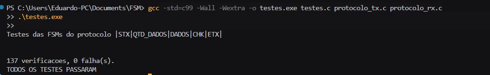
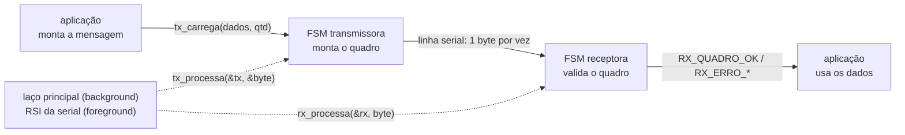
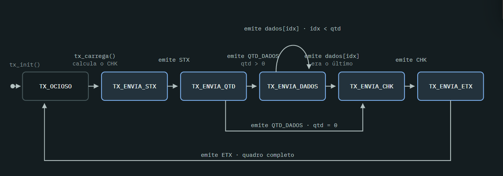
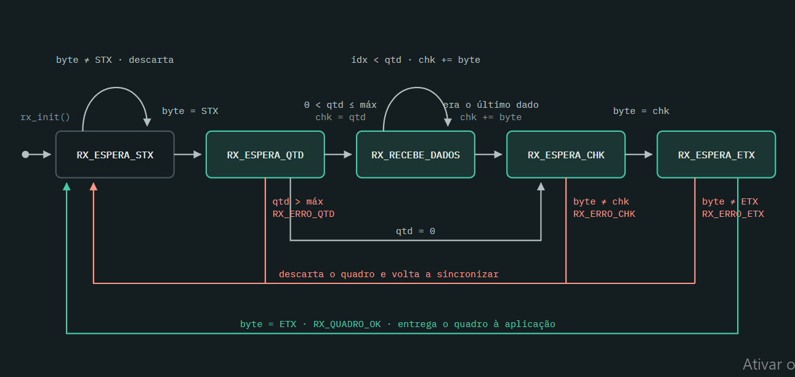

# Exercício — Tratamento de protocolo com máquina de estados (FSM)

Solução do exercício da aula "Exemplos de projeto de sistemas embarcados com máquinas de
estados finitos (FSM)" (UFSM00292 — Projeto de Sistemas Embarcados): tratamento de um
protocolo de comunicação com máquina de estados, tanto do transmissor quanto do receptor,
em linguagem C usando a diretiva `switch`, desenvolvido pela metodologia TDD.

Formato do quadro:

```
| STX | QTD_DADOS | DADOS | CHK | ETX |

STX        (1 Byte)  -> inicio da transmissao (0x02)
QTD_DADOS  (1 Byte)  -> quantidade de dados
DADOS      (N Bytes) -> dados
CHK        (1 Byte)  -> checksum da transmissao
ETX        (1 Byte)  -> fim da transmissao (0x03)
```

## Arquivos

| Arquivo | Conteúdo |
| --- | --- |
| `protocolo.h` | Interface: constantes, estados, estruturas e funções das duas FSMs |
| `protocolo_tx.c` | FSM do transmissor e cálculo do checksum |
| `protocolo_rx.c` | FSM do receptor |
| `testes.c` | Os 27 testes unitários (137 verificações) e o programa de testes |
| `main.c` | Demonstração: transmissor ligado ao receptor, com um quadro corrompido no meio |
| `Makefile` | Compilação e execução dos testes |

## Como compilar e executar os testes

```
make test
```

Ou, sem `make`:

```
gcc -std=c99 -Wall -Wextra -pedantic -o testes testes.c protocolo_tx.c protocolo_rx.c
./testes
```



Para ver as duas máquinas conversando:

```
make demo
./demo
```

## 1. Diagrama de funcionamento do sistema

Nenhuma das duas máquinas bloqueia: cada chamada trata exatamente um byte e retorna. É isso
que permite executá-las dentro do laço principal ou da rotina de interrupção da serial, sem
travar as demais tarefas do sistema esperando o quadro terminar.



## 2. Máquinas de estados

### Transmissor

Cada transição é uma chamada de `tx_processa()`, que devolve um byte para a linha. O checksum
é calculado uma única vez, no `tx_carrega()`. Um quadro sem dados (`qtd = 0`) pula o estado de
envio de dados.



### Receptor

O receptor faz o caminho inverso e ainda decide se aceita o quadro. As três setas vermelhas
são as formas de rejeitá-lo: tamanho maior que o buffer, checksum que não confere e byte final
diferente de `ETX`. Todas voltam para `RX_ESPERA_STX`, que descarta bytes até encontrar o
começo do próximo quadro — é assim que a máquina se ressincroniza sozinha após um erro na
linha.



Tabela de transições do receptor:

| Estado | Evento | Próximo estado | Retorno |
| --- | --- | --- | --- |
| `RX_ESPERA_STX` | byte ≠ STX | `RX_ESPERA_STX` | `RX_NADA` (descarta) |
| `RX_ESPERA_STX` | byte = STX | `RX_ESPERA_QTD` | `RX_NADA` |
| `RX_ESPERA_QTD` | qtd > máximo | `RX_ESPERA_STX` | `RX_ERRO_QTD` |
| `RX_ESPERA_QTD` | qtd = 0 | `RX_ESPERA_CHK` | `RX_NADA` |
| `RX_ESPERA_QTD` | 0 < qtd ≤ máximo | `RX_RECEBE_DADOS` | `RX_NADA` |
| `RX_RECEBE_DADOS` | faltam dados | `RX_RECEBE_DADOS` | `RX_NADA` |
| `RX_RECEBE_DADOS` | último dado | `RX_ESPERA_CHK` | `RX_NADA` |
| `RX_ESPERA_CHK` | checksum confere | `RX_ESPERA_ETX` | `RX_NADA` |
| `RX_ESPERA_CHK` | checksum não confere | `RX_ESPERA_STX` | `RX_ERRO_CHK` |
| `RX_ESPERA_ETX` | byte = ETX | `RX_ESPERA_STX` | `RX_QUADRO_OK` |
| `RX_ESPERA_ETX` | byte ≠ ETX | `RX_ESPERA_STX` | `RX_ERRO_ETX` |

## Decisões de projeto

- **Checksum**: soma módulo 256 do campo `QTD_DADOS` com todos os bytes de `DADOS`. O
  enunciado não define a fórmula; transmissor e receptor usam a mesma função
  (`protocolo_checksum()`), então basta trocá-la para adotar outra.
- **Um byte por chamada**: `tx_processa()` produz um byte por vez e `rx_processa()` consome um
  byte por vez. Nenhuma das funções bloqueia nem espera pela linha.
- **`PROTO_MAX_DADOS` = 64**: limite do buffer. Um `QTD_DADOS` maior que isso é rejeitado com
  `RX_ERRO_QTD`, em vez de estourar o vetor.
- **Recuperação de erro**: qualquer erro devolve o receptor a `RX_ESPERA_STX`. Um quadro
  corrompido não contamina o seguinte.
- **`STX` e `ETX` dentro dos dados**: como o comprimento vem no campo `QTD_DADOS`, o receptor
  conta os bytes em vez de procurar o `ETX`, então dados com valor `0x02` ou `0x03` passam
  intactos.

## Testes

Cada teste segue as três fases vistas em aula — configuração (estado atual, evento e resultado
esperado), exercício (estimula a máquina com o evento) e verificação (confere o estado de
destino e as saídas). São 27 testes, 137 verificações:

- **Receptor** — estado inicial; descarte de ruído fora de quadro; cada transição
  individualmente; os três erros (`QTD`, `CHK`, `ETX`); quadro completo; quadro sem dados;
  dados contendo `0x02` e `0x03`; ressincronização após quadro corrompido.
- **Transmissor** — estado inicial; recusa de quadro maior que o buffer; cada transição
  individualmente; quadro sem dados; a sequência completa de bytes emitida para um quadro.
- **Integração** — transmissor ligado ao receptor, com quadros de 0, 1 e 64 bytes em sequência.
- **Checksum** — soma de `QTD_DADOS` com os dados, com estouro em 8 bits.
